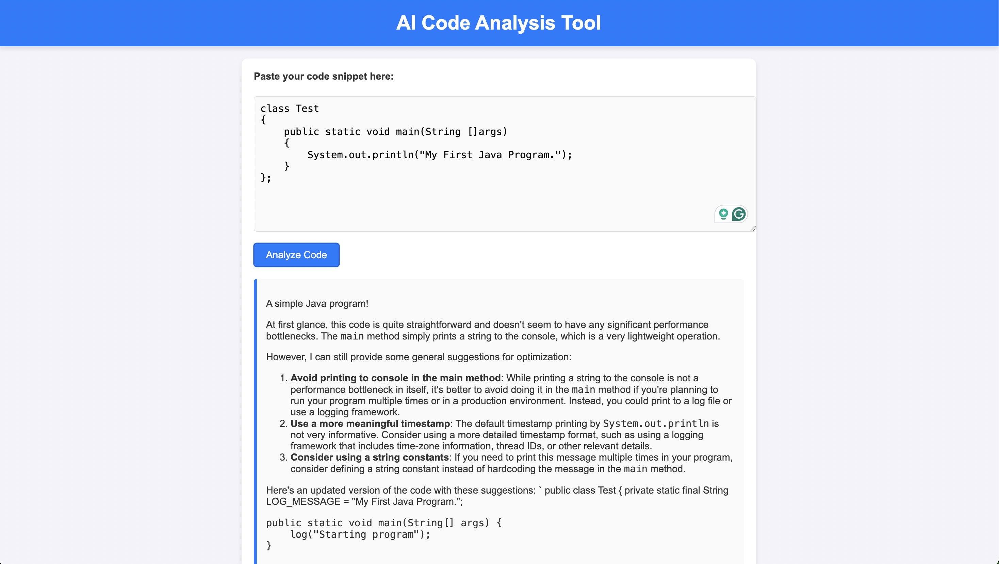

# AI Code Analysis Tool

## Overview
The **AI Code Analysis Tool** is a web-based application that allows users to paste their code into a text box, submit it for analysis, and receive detailed insights into potential performance bottlenecks, optimizations, and improvements. The analysis results are displayed in an easy-to-read markdown format, helping developers improve the quality of their code.

---

## How to Run the Project

### Prerequisites
Before running the project, ensure that you have the following:

- A modern browser (e.g., Google Chrome, Mozilla Firefox, or Safari)
- (Optional) A web server to serve the HTML file (e.g., Apache, Nginx, or a local server like Python's built-in server)

### Steps to Run Locally

1. **Clone the Repository**:
   Start by cloning the repository to your local machine:
   ```bash
   git clone https://github.com/kunalarya873/better-ai.git
   ```

2.  **Navigate to the Project Folder**: Once cloned, move into the project directory:
    
    `cd better-ai/` 
    
3.  **Open the HTML File**: You can open the `index.html` file directly in your browser:
    
    *   Simply double-click `index.html` or use a web server to serve it. If you want to test the application using a local server, run:
    
    `python app.py` 
    
    After running the above command, navigate to `http://localhost:5000` in your browser.
    
4.  **Backend Setup** (Optional): If you want to implement backend functionality to analyze the code snippets, you need to set up a backend server (e.g., Flask, Node.js). The backend should accept a POST request at `/analyze` and return the code analysis in markdown format for rendering in the frontend.
    

* * *

Design Choices
--------------

### 1\. **Frontend Design**

*   **User Interface**: The design focuses on simplicity and ease of use, with a clean layout that includes a textarea for code input, a button for submission, and a section to display the analysis results.
*   **Markdown Rendering**: Markdown is used to format the response in a readable and structured manner. This makes it easier to present detailed insights and suggestions in a neat format. The frontend uses the `Markdown.js` library to parse the markdown and render it as HTML.
*   **UI/UX**: The application features a minimalistic design with a focus on performance and ease of interaction. The buttons and text areas are designed to be responsive and intuitive, ensuring that users can easily interact with the application.

### 2\. **Backend Design** (Assumed but Not Implemented in Frontend)

*   **Code Analysis**: The backend (if set up) would analyze the code to detect performance issues, recommend improvements, and point out inefficiencies. This could be achieved using static code analysis libraries, AI models, or custom algorithms for performance bottleneck detection.
*   **API**: The frontend makes a `POST` request to the `/analyze` endpoint, which processes the code and returns the analysis in markdown format. The backend needs to be built to process this data.

### 3\. **Tech Stack**

*   **Frontend**:
    *   HTML5, CSS3, JavaScript
    *   Markdown.js (CDN link) for parsing markdown and rendering HTML.
*   **Backend**: (Optional)
    *   Could use Node.js, Flask, or any server-side framework to handle the code analysis.
    *   AI models or static code analysis tools to assess the code.

* * *

Assumptions and Limitations
---------------------------

### Assumptions:

*   The user is submitting relatively small code snippets, which can be analyzed without the need for a full-fledged IDE.
*   The backend (if implemented) is capable of processing the submitted code and returning a detailed analysis in markdown format.
*   The tool does not currently support the analysis of very large codebases or external dependencies unless the backend specifically handles these cases.

### Limitations:

*   **No Real-Time Code Execution**: The tool does not execute the code but analyzes it statically. This means dynamic performance or runtime issues may not be caught.
*   **Basic Analysis**: The analysis currently provided is based on static code inspection and does not handle more complex logic or performance optimization related to runtime behavior.
*   **Backend Not Implemented**: The backend API is assumed to be implemented by the user or developer setting up this project. Currently, it’s just a frontend application without an actual code analysis engine.

* * *

Screenshots
-----------



Here are some screenshots of the application for your reference:

### 1\. **Home Page**

Description: This is the main landing page where users can input their code snippets for analysis.

### 2\. **Code Analysis Form**

Description: This screenshot shows the user submitting a code snippet. After clicking "Analyze Code", the backend processes the input.

### 3\. **Analysis Result**

Description: The result of the analysis displayed in a clean, readable markdown format, suggesting improvements or highlighting issues in the code.

* * *

Contributing
------------

We welcome contributions! If you'd like to help improve the project, please follow these steps:

1.  **Fork the repository**: Click the "Fork" button on the top-right of the repository page to create a copy.
2.  **Create a new branch**:
    
    `git checkout -b feature-branch` 
    
3.  **Make changes**: Edit, improve, or add to the codebase.
4.  **Commit your changes**:
    
    `git commit -m 'Add feature or fix issue'` 
    
5.  **Push to your forked repository**:
    
    `git push origin feature-branch` 
    
6.  **Create a pull request**: Open a pull request on GitHub to have your changes reviewed and merged into the main repository.

